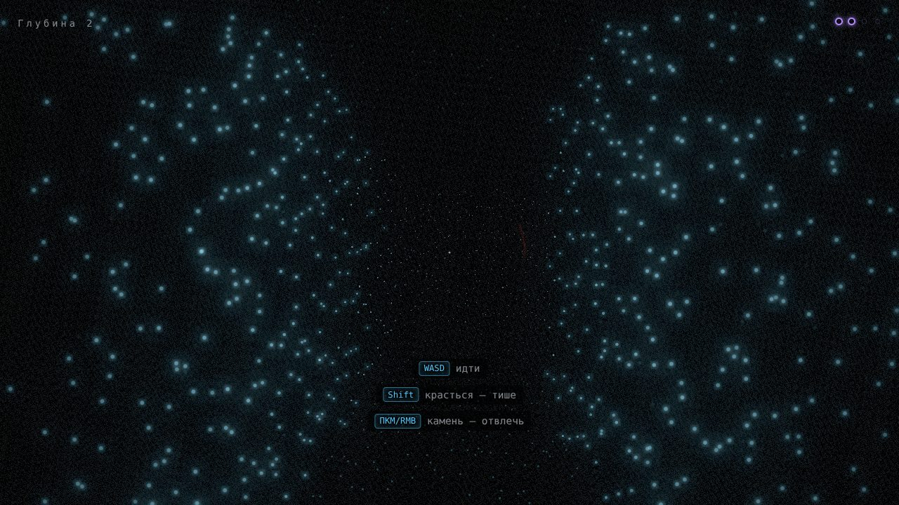
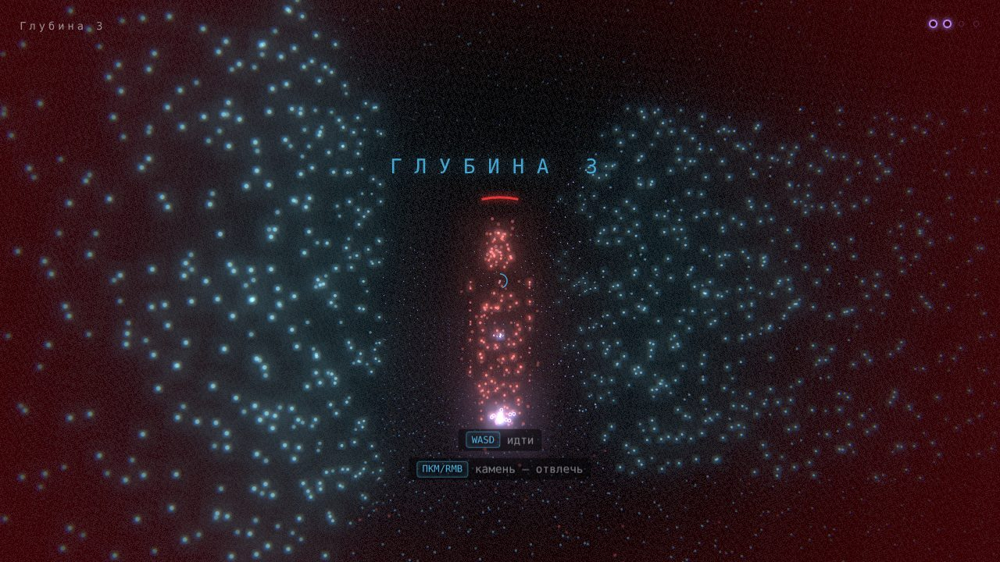

# ЭХО

**Ты видишь только звуком. И оно — тоже.** Стелс-хоррор от первого лица: мир проявляется облаком светящихся точек только там, куда дошёл звук, а слепые монстры идут на любой шум.




## Управление

| Действие | Клавиатура / мышь | Геймпад |
|---|---|---|
| Идти | WASD | левый стик |
| Смотреть | мышь (или ← → / Q E) | правый стик |
| Хлопок — увидеть | ЛКМ / Space | RT / A |
| Бросить камень — отвлечь | ПКМ / F | LT / X |
| Бежать (быстро, но громко) | Shift | L3 / RB |
| Красться | C / Z | LB / B |
| Пауза | Esc / P | Start |
| После смерти: с зелёного маяка или заново | R | Back |

Лучше в наушниках. Без наушников включены индикаторы направления звука вокруг прицела.

Полное руководство игрока: [`docs/guide.md`](docs/guide.md).

## Сайт

- `/` — лендинг (`index.html`, `src/landing/`)
- `/play/` — игра (`play/index.html`, `src/main.ts`)
- `/play/?trailer` — режим трейлера; `npm run build && node scripts/render-trailer.mjs` рендерит `public/trailer.mp4`

## Разработка

```bash
npm install
npm run dev        # http://localhost:5173
npm test           # юнит, сценарии, симуляция баланса
npm run sim        # отчёт по кривой сложности
npm run smoke      # Playwright: скриншоты, ошибки консоли, пики звука
npm run build      # dist/
```

URL-параметры: `?seed=abc`, `?depth=3`, `?debug` (F1 — оверлей, F2 — показать уровень, F3 — бессмертие, F4 — к выходу, `[` `]` — скорость времени).

## Структура

```
src/core     цикл с фиксированным шагом, RNG с сидом, шина событий, математика
src/game     чистая логика: уровни, симуляция, монстры, бот (без DOM/WebGL/звука)
src/content  данные: монстры, глубины, улучшения
src/render   облако точек, эхо, сцена, постобработка
src/audio    движок звука и процедурные эффекты
src/input    действия, переназначение, геймпад, буфер ввода
src/ui       HUD и экраны
src/app      состояния игры, связка событий → звук/эффекты/UI, обучение
src/save     сохранения с миграциями
src/i18n     ru / en
src/debug    оверлей и читы
tests/       vitest     e2e/  playwright     docs/  GDD, стайл-гайд, ADR, план
```
